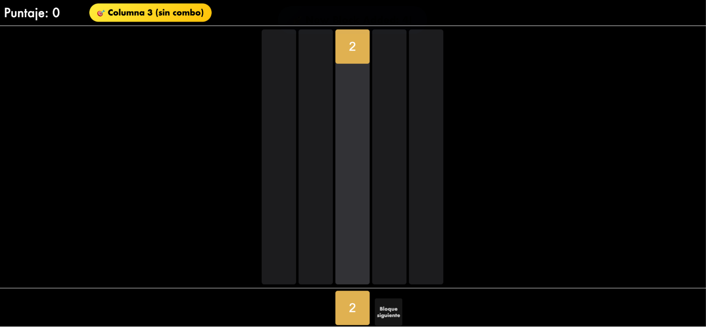

# Informe de la Resolución del Proyecto
*M2 Blocks - Lógica para Cs. de la Computación - 2025*

**Comisión `[Nro]`**:
- `[Ap. y Nombre de integrante 1]`
- `[Ap. y Nombre de integrante 2]`
- `[Ap. y Nombre de integrante 3]`
---

Introducción
Este informe detalla la implementación del proyecto desarrollado en Prolog y React, basado en un juego tipo M2 Blocks. Se explican las decisiones estratégicas tomadas para cumplir con los requerimientos funcionales, los desafíos encontrados, funcionalidades extra incorporadas y los tests realizados, incluyendo capturas de pantalla

Implementación en Prolog
Resolución de requerimientos
Generación aleatoria del bloque a disparar: Si la grilla está vacía, se genera solamente el bloque 2. Caso contrario, se busca el máximo valor desbloqueado hasta el momento, este valor se utiliza para definir un rango válido de números que pueden ser generados. Luego se generan todas las potencias de 2 hasta el máximo valor de la grilla, los cuales se filtran para ver si están dentro del rango permitido, esto permite no generar bloques que no queremos. Para excluir bloques, utilizamos una lista dinámica para los “bloques prohibidos” la cual se actualiza a medida que el juego avanza. Por último, de la lista de números disponibles (potencias de 2 dentro del rango permitido y no prohibidas) se llama a una función que selecciona un valor random de la lista. 
Efecto del disparo de un bloque: Lo primero que se hace en el disparo, es la caída del bloque, es simular que el bloque cae en una columna específica de la grilla, esto resulta en una nueva con el bloque ya posicionado y se obtiene el lugar donde cayó. Luego de esto se activan los efectos, primero se buscan los grupos de 2 o más bloques adyacentes que posean el mismo valor, se toma como prioridad el bloque recientemente lanzado, y se fusionan los bloques pertenecientes a este grupo, luego se vacían las celdas que ocupan los bloques y se retorna una nueva grilla con el nuevo bloque fusionado y las celdas vacías. Después de cada fusión se actualiza la lista de bloques prohibidos.
Avisos “Combo x N”: El proceso para generar el aviso “Combo x N” parte de la definición del predicado de “disparo” que, ante una jugada, produce una lista de efectos (realiza cascadas de fusiones a partir del bloque colocado en la grilla).
Dentro de estos efectos, se describe cómo la grilla evoluciona tras cada fusión de bloques. Prolog no calcula directamente el tamaño del combo ni dispara la notificación; simplemente informa, paso a paso, los nuevos estados del grid y la aparición de nuevos bloques o puntuación. 
Avisos de nuevo bloque máximo logrado: Para este requerimiento, lo que se hace es enviarle la información al Front desde el disparo avisando cual es el bloque nuevo fusionado, en base a ese valor se actúa avisando si hubo un nuevo bloque desbloqueado.
Booster Hint jugada: Este booster nos permite que por cada columna donde se apoya el cursor nos diga un posible combo con el bloque a disparar dado en esa jugada, en caso de que no haya ningún combo simplemente nos aparecerá el cartel de que esa columna se encuentra sin combo.
Booster bloque siguiente: Cuando seleccionemos en el bloque de este booster nos dará por un tiempo limitado con una barra el próximo bloque a disparar para que podamos decidir mejor con el bloque actual donde posicionarlo. Una vez que la barra se completa vuelve a cubrirse, aunque se puede seleccionar cuántas veces se quiera para utilizarlo.
Funcionalidades adicionales
Colocar el bloque en una columna: Se intenta colocar el bloque desde abajo de la columna, y se deja caer, haciendo un efecto de gravedad hasta la primera celda vacía. Comienza por la fila superior de la columna y va bajando recursivamente hasta encontrar la primera celda vacía. Una vez que la encuentra, se coloca el bloque. Si llega al final de la columna sin encontrar un espacio, se considera que la columna está llena. 
Detectar grupos y fusionar: Lo primero que se hace es detectar los grupos de bloques adyacentes con el mismo valor utilizando un recorrido BFS. Luego se valida el tamaño del grupo, para que al menos tenga dos miembros y se calcula el valor resultante. Se vacían las celdas que ocupan los miembros del grupo y se coloca el nuevo bloque en la posición inicial del bloque más importante del grupo, es decir, el último lanzado, y si la fusión no se produce por el lanzamiento, se usa la posición del primer bloque detectado. Para finalizar, se simula la “gravedad” para toda la grilla para llenar los espacios vacíos en caso de ser necesario.
Compactar columnas: Esta funcionalidad sirve para que la grilla se vea “compacta” y sin celdas vacías, haciendo que todos los bloques estén siempre apilados en la parte superior de la grilla y las celdas vacías por debajo. Se itera sobre cada columna y se extraen todos los valores, se separan los bloques de las celdas vacías y se reconstruye la columna colocando primero los bloques y luego las celdas vacías. Por último se actualiza la grilla y se repite este proceso hasta que cada columna haya sido procesada.
Cascada de fusiones y efectos: Esta funcionalidad se encarga de, primero, asegurarse que la grilla esté limpia de bloques prohibidos y que esté compacta. Luego se lanza el bloque en la columna seleccionada, y se buscan todas las posibles fusiones dentro de la grilla, si hay un grupo de 2 o más bloques, se le da prioridad al recién lanzado o recién colocado. Se actualizan los bloques prohibidos para que no se fusionen repetidamente. Limpia y compacta la grilla inmediatamente, luego registra los cambios y efectos de cada paso de la cascada, y se repite el bucle hasta que no queden más fusiones posibles.
Desafíos y soluciones
Booster Hint jugada: Lo complejo de este booster fue planearlo a nivel de lógica por parte de prolog como iba capturando los posibles combos y que no falle en esa predicción porque tenía que simular las posibles caídas del bloque actual en la propia columna y analizar esas fusiones para encontrar el grupo más grande de bloques que se unieron en un solo paso dentro de esa cadena. 

Implementación en React
Integración con Prolog
Resolución de requerimientos
Animaciones de disparo, fusión y caída: Para realizar todas las animaciones se hizo uso de la librería former-motion.
Avisos: Aquí lo que se hace es detectar en la lógica el nuevo valor desbloqueado, o los combos realizados. Si el suceso es significativo se genera un aviso para cada ocasión.
Booster Hint jugada:
Booster siguiente bloque: hablar de la barra de progreso y su timeout

Casos de Test
1. Disparo de un bloque

2. Fusión en Cadena

3. Generación de un nuevo bloque con su mensaje

4. Cambio de rango y limpieza de bloques retirados

5. Boosters Activados

6. Combos

Consideraciones
Para poder visualizar bien las animaciones y sus efectos, hicimos uso de la librería framer-motion.
Si se llegó al momento de, por ejemplo, desbloquear el bloque 1024 y eliminar el bloque 2, si en ese momento se pierde el juego, al reiniciarlo luego de desbloquear el bloque 4 nuevamente se elimina el bloque 2 incorrectamente.
Si se completa la grilla pero en el último movimiento existe la posibilidad de una última fusión, el juego detecta que la grilla se llenó antes de realizar la fusión, lo que resulta en que se ejecute el GAME OVER.
El booster “Hint Jugada” está siempre activo, si se pasa el cursor sobre cualquier columna, se le indica al jugador la combinación resultante si se tira el bloque en esa columna.
La aridad del combo es producida por la cantidad de bloques que se fusionen en una tirada, es decir, si juntamos 3 bloques de valor 4, surge la notificación de combo x 3.
